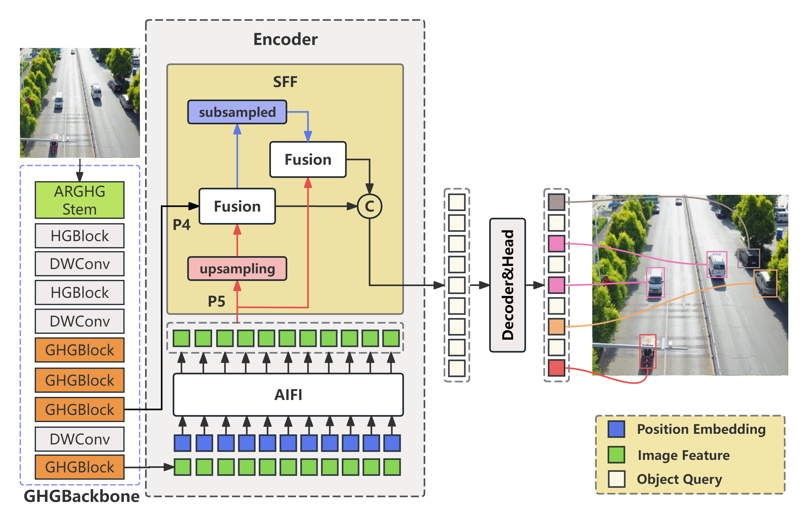
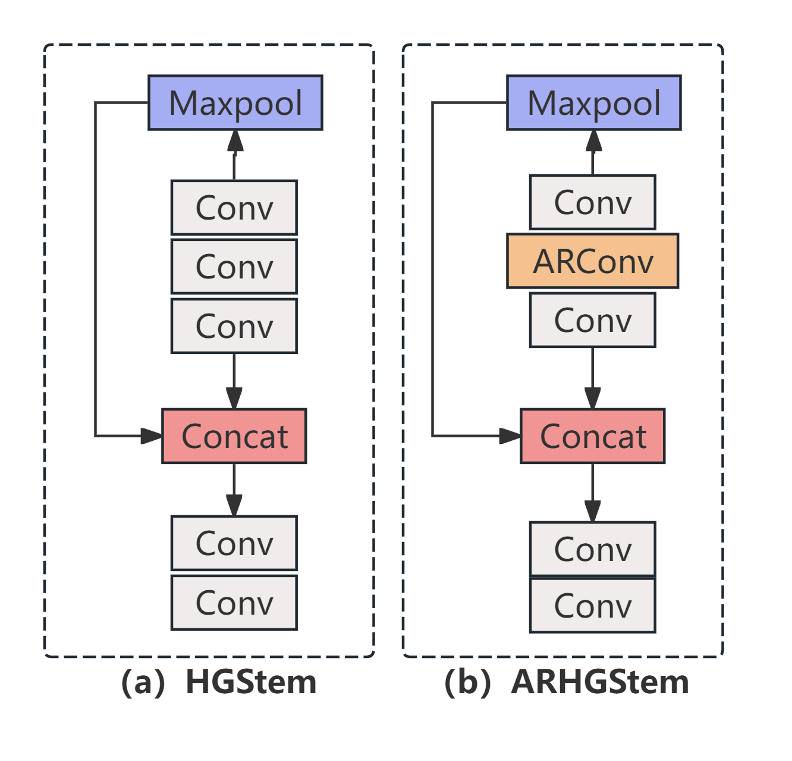
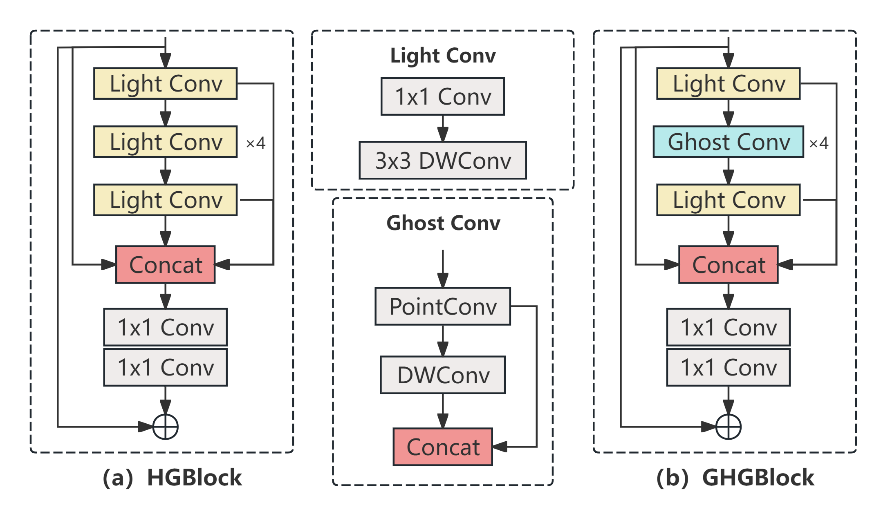
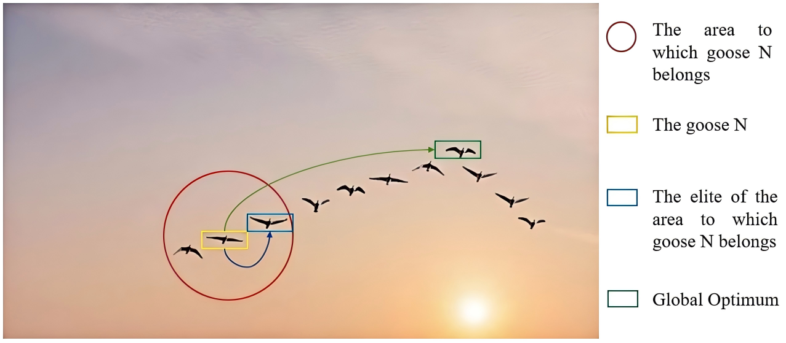

## 1. This is the overall architecture of GSR-Net.



## 2.To achieve higher real-time detection performance in UAV small target detection, we designed a new feature extraction module GHGStem and a lightweight detection backbone GHGBlock. The core of these techniques benefit from [GhostConv](https://github.com/huawei-noah/Efficient-AI-Backbones) and [ARConv](https://github.com/WangXueyang-uestc/ARConv.git).

 &nbsp;&nbsp;&nbsp;&nbsp;&nbsp;

## 3. A new hyperparameter tuning algorithm, called R-PSO, is proposed, which refers to the heuristic principle of geese flying to maintain the overall formation.



## 4. Install the ultralytics package, including all [requirements](pyproject.toml), in a Python>=3.8 environment with PyTorch>=1.8.
```python
pip install ultralytics
```
## 5. Model training.
```python
from ultralytics import RTDETR

# Load model
model = RTDETR("GSR-Net.yaml")

# Start training
model.train(
    data="datasets/data.yaml",   # Path to dataset config file
    epochs=200,                  # Number of training epochs
    batch=16,                    # Batch size
    imgsz=640,                   # Input image size
    device=0,                     # GPU device (0); use "cpu" for CPU training
    workers=8,                   # Number of dataloader workers
)
```
## 6. 🚀 Hyperparameter tuning.
```python
from ultralytics import RTDETR

# Initialize model
model = RTDETR("GSR-Net.yaml")

# Define full hyperparameter search space
search_space = {
    "lr0": (1e-5, 1e-1),
    "lrf": (0.01, 1.0),
    "momentum": (0.6, 0.98),
    "weight_decay": (0.0, 0.001),
    "warmup_epochs": (0.0, 5.0),
    "warmup_momentum": (0.0, 0.95),
    "box": (0.02, 0.2),
    "cls": (0.2, 4.0),
    "dfl": (0.5, 3.0),
    "hsv_h": (0.0, 0.1),
    "hsv_s": (0.0, 0.9),
    "hsv_v": (0.0, 0.9),
    "degrees": (0.0, 45.0),
    "translate": (0.0, 0.9),
    "scale": (0.0, 0.9),
    "shear": (0.0, 10.0),
    "perspective": (0.0, 0.001),
    "flipud": (0.0, 1.0),
    "fliplr": (0.0, 1.0),
    "mosaic": (0.0, 1.0),
    "mixup": (0.0, 1.0),
    "copy_paste": (0.0, 1.0),
}

# Start hyperparameter tuning
model.tune(
    data="datasets/data.yaml",   # Dataset config (default path)
    epochs=30,                   # Training epochs per trial
    iterations=300,              # Number of search iterations
    optimizer="AdamW",           # Optimizer choice
    space=search_space,          # Defined hyperparameter space
    plots=True,                  # Enable tuning visualization
    save=True,                   # Save best model and logs
    val=True                     # Validate at each iteration
)
```
## 7. Below are our detection results on the public dataset VisDrone2019，and the actual test results conducted in the Shihezi University.

&nbsp;&nbsp;&nbsp;&nbsp;&nbsp;

## 8. We thanks the open source by  [ultralytics](https://docs.ultralytics.com/zh).
## 9. Please refer to the pre-launch article for details.
